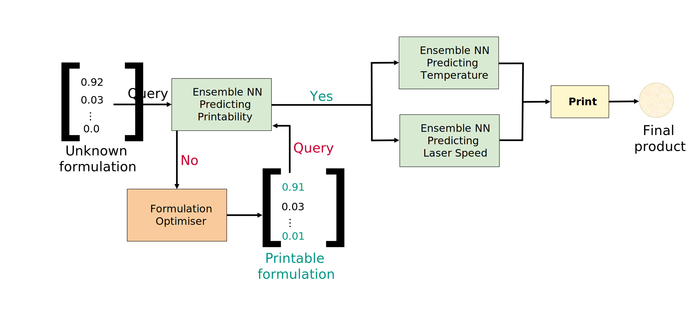

# Closing the loop: An Automated End-to-End 3D Printing Pipeline for Personalised Drug Formulations
Youssef Abdalla, Martin Ferianc, Haya Alfassam, Atheer Awad, Ruochen Qiao, Miguel Rodrigues, Mine Orlu, Abdul W. Basit, David Shorthouse

## Overview
This project demonstrates a fully automated pipeline for formulation design and 3D printing of personalised drug formulations. By leveraging advanced computational methods and deep learning, we significantly reduce the time and effort required for drug formulation development.

### Key Features
- **Regressor**: Replaced with an Ensemble NN for enhanced predictive accuracy.
- **Optimisation Algorithms**: All optimisers are available in the `recommenders/proportion` directory.
- **Tuning Scripts**: Utilities for hyperparameter tuning can be found in the `utils` directory.

## Abstract
Three-dimensional (3D) printing offers a promising approach to creating personalised medicines. However, traditional trial-and-error methods are costly and require significant expertise, posing challenges for tailoring treatments to individual patients. 

To address these challenges, we developed a novel pipeline for formulation design and 3D printing using selective laser sintering (SLS). This pipeline integrates a Differential Evolution-based optimiser to generate formulations for desired drugs and a Deep Learning Ensemble to predict optimal printing parameters along with confidence intervals.

### Highlights
- **Diverse Formulations**: The pipeline generated formulations with a wide variety of materials and high printability probabilities.
- **High Success Rate**: 80% of generated drug formulations were successfully printed, with 92% accuracy in predicting printing parameters.
- **Efficiency**: Development and printing time for new drug formulations was reduced from approximately one week to a single day.

